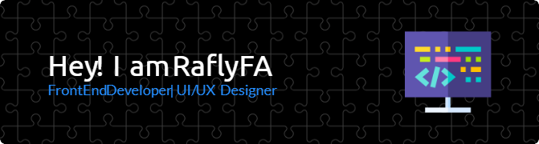

## Hallo!! I'm Rafly FA 👋

<!--
**RaflyFA/RaflyFA** is a ✨ _special_ ✨ repository because its `README.md` (this file) appears on your GitHub profile.

Here are some ideas to get you started:

- 🔭 I’m currently working on ...
- 🌱 I’m currently learning ...
- 👯 I’m looking to collaborate on ...
- 🤔 I’m looking for help with ...
- 💬 Ask me about ...
- 📫 How to reach me: ...
- 😄 Pronouns: ...
- ⚡ Fun fact: ...
-->

🌱 I’m currently learning **Next JS**

#### Skills

#### Framework

#### Design

#### Connect With Me
   

<h2 align="left">Play games whith me</h2>

###

<picture>
  <source media="(prefers-color-scheme: dark)" srcset="https://raw.githubusercontent.com/RaflyFA/RaflyFA/output/pacman-contribution-graph-dark.svg">
  <source media="(prefers-color-scheme: light)" srcset="https://raw.githubusercontent.com/RaflyFA/RaflyFA/output/pacman-contribution-graph.svg">
  
</picture>

###